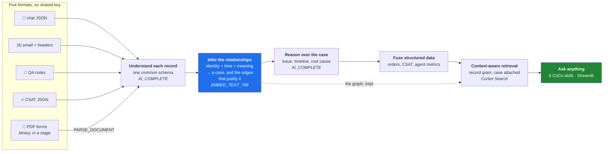

# Case Intelligence

**Snowflake CoCo Hackathon 2026 · Track 2 (Unstructured Data Intelligence)**

🔗 **Live demo:** https://coco-case-intelligence.streamlit.app

A support leader cannot see that five contacts across five systems are one angry customer
and one order at risk. The chat, the email, the QA note, the survey and the PDF escalation
form describe the same problem in different words, and **not one of them carries an
identifier the others share**. Every count, every driver and every escalation built on top
of that pile is wrong, because the unit everyone reasons in — the *case* — does not exist
in the data.

This system infers it. `case_id` appears in **no source record**: it is worked out from
who the records name, what they mean, and when they arrived. Ask one question and the
answer spans five formats and a binary file without you knowing where it came from — but
behind that single surface is a graph of inferred relationships, and every edge in it can
be shown.



## What it actually understands

**Cross-document reasoning, not document search.** Records that share no key are resolved
into one case using three signals together — a fuzzy name, proximity in time, and what the
complaint *means*. The relationships are inferred, then **kept**: `int_case_edges` holds
every link with the evidence behind it, so a case can always be taken apart and justified.

Here is a real one from the current build, `CASE_G007` — five records, five formats, no
identifier anywhere:

```
email_0005  ↔ chat_0007   semantic   cosine 0.877   17.3h apart
email_0005  ↔ esc_0003    semantic   cosine 0.789    3.9h apart     ← a PDF
csat_0009   ↔ esc_0003    semantic   cosine 0.792    1.7h apart
chat_0007   ↔ qa_0009     semantic   cosine 0.712    9.0h apart
```

A binary escalation form tied to a chat message by nothing but a surname, the meaning of
the complaint, and a few hours. Ask CoCo *"why are these one case?"* and it narrates
exactly that.

**This is not a RAG demo.** Retrieval exists, but it is the last step rather than the
trick: every hit from Cortex Search arrives carrying its resolved `case_id` and everything
Stages 3 and 4 derived about that case — root cause, resolution state, revenue at risk. So
retrieval and analysis join in one step, and the interesting answer ("these five messages
are actually three cases") is one the index alone could never give.

**Structured data is evidence, not decoration.** Orders and CSAT are not just joined on at
the end for enrichment. When two different customers share a surname, contact support the
same afternoon, about the same issue, nothing in the text can separate them — the order is
what proves they are two people. That case is measured below, and it is where the fusion
earns its place.

## Measured result

Identity resolution over **614 records / 192 planted cases / 67 customers**, scored against
a ground-truth key the pipeline never reads (`data/synthetic/ground_truth.json`).

The corpus is deliberately in two halves, and the split is the whole point. Tiers A-C are
generated under conditions the resolver needs — unique surnames, a customer's cases far
apart in time. **A perfect score on those measures the generator, not the method**, so they
are published as a regression floor rather than as a result. Tier D breaks those conditions
on purpose, at collision rates taken from real-shaped reference data
([`docs/realism-report.md`](docs/realism-report.md), where 82% of customers collide on
surname). Tier D is the result.

| tier | shape | cases | recall | precision |
|---|---|---:|---:|---:|
| A | entity overlap | 53 | 1.000 | 1.000 |
| B | **semantic only — the keyless hero tier** | 103 | 1.000 | 1.000 |
| C | shared ticket id | 14 | 1.000 | 1.000 |
| **D** | collision, identity present | 6 | **1.000** | **1.000** |
| **D** | collision, identity corrupted | 4 | 0.750 | 1.000 |
| **D** | collision, fully keyless | 6 | 1.000 | **0.000** |
| **D** | same customer, one window | 6 | 1.000 | 0.800 |
| noise | must not merge | 55 | 1.000 | 1.000 |

**Tier D overall: recall 0.955, precision 0.789.** Read the two extremes, because they are
the honest edges of the method:

- **Identity present, 1.000/1.000.** Two *different* customers who share a surname, contact
  support the same afternoon, about the *same* issue, with their records interleaved in
  time. Name, time and meaning all agree — nothing in the unstructured text can separate
  them. The order and the address can, and do. This is the proof that fusing structured with
  unstructured data is load-bearing here rather than decorative.
- **Fully keyless, 0.000.** The same collision with no identifier anywhere. Every pair false
  merges. Two strangers who share a surname, write in the same hours, and carry no
  identifier simply cannot be told apart from text — the measured limit of keyless linking,
  stated rather than hidden.

Also measured: **31 of the 41 PDF escalation forms sit in the keyless tier and were linked
semantically** — a binary document tied to a chat and an email by nothing but a surname, the
meaning of the complaint, and a few hours. Every link is inspectable in `int_case_edges`,
and the whole table above is a query: `select * from agg_linkage_accuracy`.

Four of these are build gates, not claims: `assert_cases_fully_linked`,
`assert_no_case_contamination`, `assert_noise_stays_isolated` and
`assert_tier_d_precision_holds`. `dbt build` fails if any regresses.

## How it is built

The mechanics, once the argument above is made. dbt owns a deterministic, tested backbone;
Cortex AI SQL runs *inside* the models, so there is no orchestration layer shuttling data
to an LLM and back.

| Stage | Model(s) | What it does | Cortex |
|---|---|---|---|
| 1 normalize | `stg_chat` / `email` / `qa_notes` / `csat` / `documents` → `stg_records` | every format, text and binary, into one common schema | PARSE_DOCUMENT, AI_COMPLETE |
| 2 resolve | `int_record_entities` + `int_record_embeddings` → `int_linkage_graph` (Snowpark) → `int_case_assignments`, `int_case_edges` | infer which records are one case, and keep the edges that prove it | EMBED_TEXT_768 |
| 3 synthesize | `fct_case_fact` | collapse each case into one row: issue, timeline, resolved, root cause, sentiment | AI_COMPLETE |
| 4 enrich | `fct_case_enriched` | attach the order, survey and agent metrics belonging to *that* case | SQL |
| 5 retrieve | `search_corpus` → `CASE_RECORD_SEARCH` | index every raw record, with its case and derived attributes attached | Cortex Search |
| 6 act | `agg_*`, `coco/skills/`, `app/` | rollups, natural-language Q&A, evidence, drivers, recommend, deliver | AI_COMPLETE |

Stage 2 is the one worth reading. It is a dbt **Python** model that returns the linkage
graph — assignments *and* edges — as one relation, because a Python model can only return
one. Embeddings are computed once in their own model and read twice. Candidate pairs come
from inverted indexes on the gate keys rather than a full pairwise scan, which on this
corpus is roughly 3,000 comparisons instead of 188,191. The rules, and the two that were
measured and rejected, are documented in [`AGENTS.md`](AGENTS.md).

## Synthetic data

We generate both halves of the data so the pipeline runs end to end today; real data swaps
in later at the same schemas (see below). `scripts/generate_synthetic_data.py` is
deterministic and produces **614 records across 192 cases and 67 customers** in five
formats and four difficulty tiers:

- **Tier A** entity overlap (shared email / order ref)
- **Tier B** semantic-only, the hero: no shared key, linkable by fuzzy name + issue semantics + time
- **Tier C** trivial (shared ticket id), plus noise that must not merge
- **Tier D** adversarial: colliding surnames, corrupted addresses and repeat episodes inside
  the link window. The tier that exists so the headline result cannot be self-fulfilling;
  its rates come from [`docs/realism-report.md`](docs/realism-report.md)

The five formats are chat JSON, email with headers, free-text QA notes, CSAT JSON, and
**real PDF escalation forms**. The PDFs are written by the generator, uploaded to a
Snowflake stage, and read back with Cortex `PARSE_DOCUMENT`, so the pipeline genuinely
spans a binary modality rather than four flavours of text.

## Run it

**First time on a new machine or account, follow [`docs/SETUP.md`](docs/SETUP.md).** It
covers the Snowflake objects, the Anaconda terms step needed by the Stage 2 Python model,
key-pair auth, the environment variables, and the regional Cortex caveat. About 30 minutes.

Once set up:

```bash
source .venv/bin/activate && source .env          # credentials, see docs/SETUP.md
dbt deps --profiles-dir .
python3 scripts/upload_documents.py               # PDFs -> Snowflake stage (once)
dbt build --profiles-dir .                        # seed -> run -> test, one command
streamlit run app/streamlit_app.py                # the demo UI: case anatomy first
```

The data is committed, so you only need the generator if you want to regenerate it (it is
deterministic and produces identical output):

```bash
python3 scripts/generate_synthetic_data.py
dbt build --profiles-dir . --full-refresh
```

Auth: dbt uses key-pair auth, configured through environment variables in `profiles.yml`.
Cortex/CoCo use a named connection in `~/.snowflake/connections.toml`. A full build makes
roughly 1,500 Cortex calls, so it is cheap but not free.

## Talking to your data through CoCo (the agentic layer)

The six CoCo Agent Skills in `coco/skills/` are the single surface the whole thing is
experienced through. Register them once (machine-local):

```bash
bash scripts/register_skills.sh
cortex -c case_intel
```

Then ask in plain English. The order below is the order they matter in:

| Skill | Ask it |
|---|---|
| **search_case_records** | *"What are customers actually saying about damaged items in multi-unit orders?"* Retrieves the real records across all five formats with Cortex Search, then answers from their own words. |
| **ask_case_intelligence** | *"How many cases are unresolved and what is the total revenue at risk?"* |
| **explain_case_linkage** | *"Why are the records in CASE_G007 one case? Show me the evidence."* Narrates the actual edges: which signal, what similarity, how many hours apart, and whether the case was fully keyless. |
| **diagnose_top_drivers** | *"What is the biggest driver of revenue at risk, and why?"* |
| **recommend_action** | *"Recommend a concrete action for the top driver."* |
| **deliver_action** | *"Draft the message to send the owning team."* Posts via MCP if Slack or ticketing is configured; otherwise returns the ready-to-send message. |

All six have been tested end to end against the live warehouse: CoCo writes its own SQL
over the marts, grounds every number it states, and chains search → explain → diagnose →
recommend → deliver. Note that CoCo's SQL tool needs browser or PAT auth on its connection,
not the key pair dbt uses — see [`docs/SETUP.md`](docs/SETUP.md) §9.

## Swapping in real data

Everything is built against the contract in `AGENTS.md`, not against specific files. To use
real data, replace the generator's outputs at the **same schemas**:

- unstructured -> the `RAW_*` seed CSVs (or a Snowpipe/stage load into the same tables)
- structured -> `seeds/orders.csv`, `seeds/csat_scores.csv`, `seeds/agent_daily_metrics.csv`

Then `dbt build`. No model changes.

## Development

```bash
pip install -r requirements.txt -r requirements-dev.txt
ruff check .        # lint, including the bandit security rules
pytest              # unit tests, no Snowflake connection needed
```

CI runs the same three steps plus a `dbt parse` on every push, and re-runs the generator to
prove the committed corpus is still reproducible from it. Nothing in CI needs credentials.
The accuracy tests that do need a warehouse run inside `dbt build`.

## Demo

[`docs/demo-script.md`](docs/demo-script.md) is a four-minute shot list with the exact
prompts to type and the answer shape to expect from each.

## Known limitations

Full-refresh only (no incremental). LLM output can be malformed and is guarded with
`TRY_PARSE_JSON`. Structured enrichment attaches only where an identity resolves.
